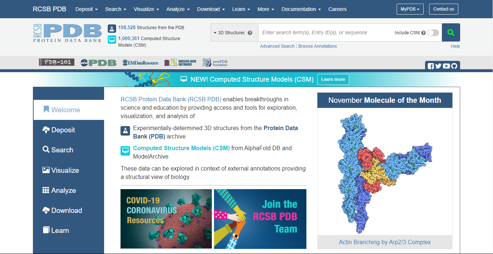
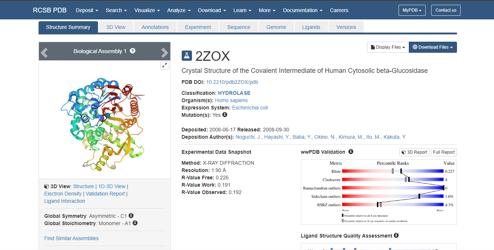
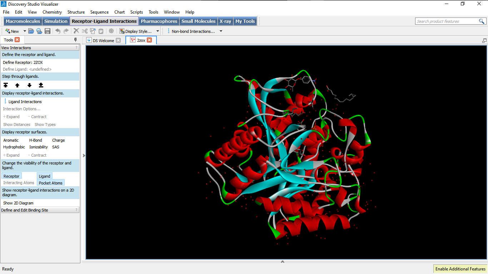
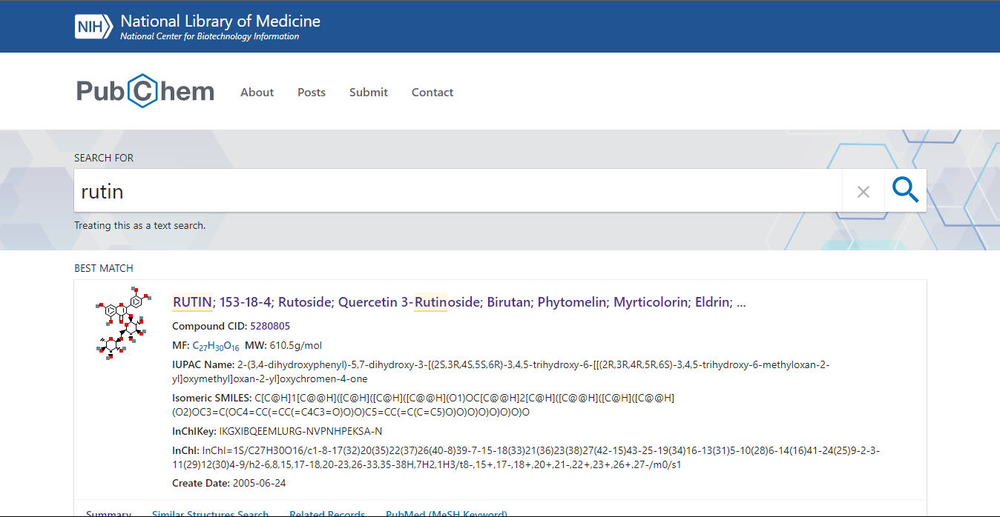
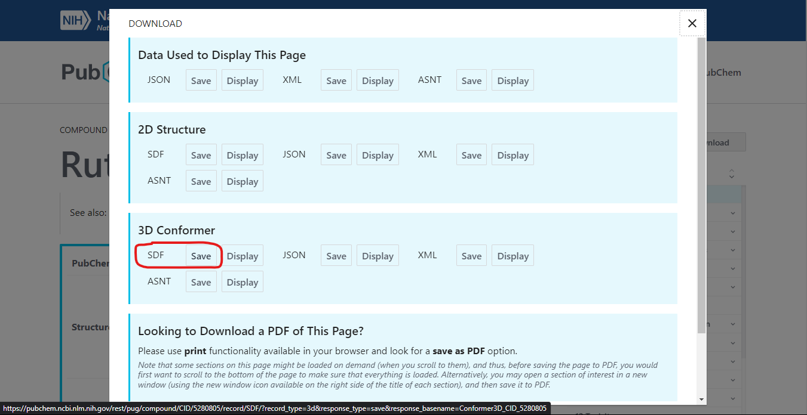
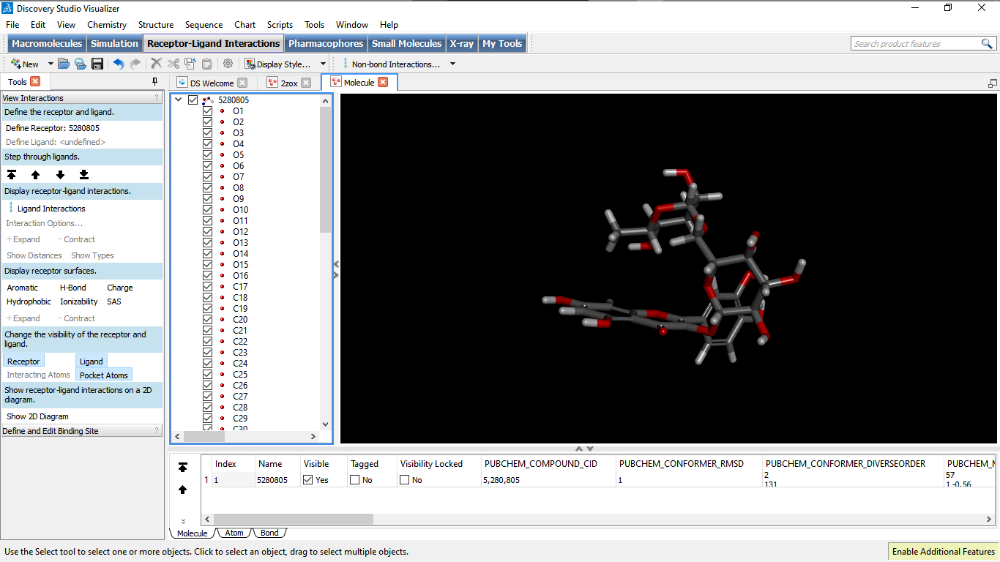
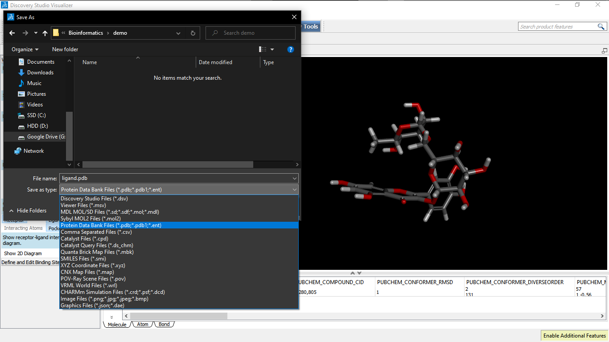

# {{ $frontmatter.title }}
Published: {{ $frontmatter.date }}

## Abstract
Docking of various therapeutically important chemical entities to the specific target sites offers a meaningful strategy
that may have tremendous scope in a drug design process. For a thorough understanding of the structural features that
determine the strength of bonding between a ligand with its receptor, an insight to visualize binding geometries and
interaction is mandatory. Bioinformatical as well as graphical software ‘PyMOL’ in combination with the molecular
docking suites Autodock and Vina allows the study of molecular combination to visualize and understand the structurebased drug design efforts. In the present study, we outlined a user friendly method to perform molecular docking using
vina and finally the results were analyzed in pymol in both two as well as three-dimensional orientation. The operation
bypasses the steps that are involved in docking using cygwin terminal like formation of gpf and dpf files. The simple
and straight-forward operation method does not require formal bioinformatics training to apprehend molecular docking
studies using AutoDock 4.2 program.

_**Keywords:** Auto-Dock; Chemdraw; DSV (Discovery Studio Visualizer); PDB (Protein Data Bank) and Pubchem: PYMOL_

## 1. Introduction
In the present era of technology advancement, various operations are performed with the help of computer to increase
the reliability, productivity and most importantly the ease of the work. For example, in the field of computer-aided
structure-based drug designing, molecular docking has been frequently used to predict the prominent and acknowledged
geometry of a protein-ligand complex and to understand the interaction studies of the target with specific ligands. The
authentication of docking methodology can be validated by parallel crystallography techniques. In addition, docking is
often used in addition with scoring functions to predict binding affinities of ligands in virtual screening experiments (1).
It is also important in studying the structure activity relationships in the synthesis of new compounds (2 and 3). The
function of docking is to define the energetics of the system and the efficiency of the ligand molecule to bind to its
target, as it forms the basis of the docking algorithms attempt. In recent years, the process of virtual screening technique
for docking small molecules into a known protein structure is a powerful tool for drug design and has become an
integral part of the drug discovery process. Various Computational tools like Auto-Dock are available that offer the
advantage of molecular docking at a relatively faster pace (4). Auto-Dock is freely available docking software that
employs a Lamarckian type of genetic algorithm for computing ligands with varying conformations and minimization
of the scoring function that attributes to its energy. However, the use of Auto-Dock in virtual screening is limited to the
chemical compounds whose features can be calculated (5).
In the present study, we provide an easier protocol for the molecular docking process using Auto-Dock and Vina. The
method was substantiated by taking example of molecular docking of Glucose 6 phosphate isomerase with its ligand Dglucose 6 phosphates.

## 2. Methods
* 2.1 Retrieval of required protein files from major databases.
  - 2.1 1. (a) Retrieving protein.pdb files from major protein databases using following link. [https://www.rcsb.org/](https://www.rcsb.org/)
    
    Fig. 1: Screenshot Showing the Home Page of the PDB (Protein Data Bank) on Computer Screen

    Enter the name of Protein or enzyme that will be used for docking studies (For example, Beta-Glucosidase or its pdb id 2ZOX).
    
    Fig. 2: RCSB Protein Data Bank Page Showing the Selection of Protein.

    Select ‘Download file from drop down list’.
    Click PDB File (text) and download it.
    Open this text file to select and delete all the heteroatoms. Next step involves deletion of B chain as both the chains of
    the protein are similar and ligands will bind to either of the two chains.
    Now, to cross check whether all the heteroatoms of chain A and B chain have been deleted, one can take help of the
    software discovery studio visualizer 3.5 (which can be downloaded freely from the given link. https://discover.3ds.com/discovery-studio-visualizer-download

    
    Fig. 3: Screenshot of the Screen to Show Absence of Heteroatoms

* 2.2. Retrieval of ligand molecules from different ligand databases: http://pubchem.ncbi.nlm.nih.gov/ or http://www.drugbank.ca/
  The above links can be used to select desired ligand/drug molecules. Alternatively, the structure of the ligand molecules
  can be drawn with the help of software available like chemdraw. However, it will be more convenient to download the
  file from the databank.
  
  Fig. 4: Showing Pubchem Home Page of Searched Molecules

  Click on 3D image and save 3D Sdf.
  Open it using discovery studio visualizer and save it as a protein data bank file.(pdb file) because the autodock software
  can only recognize files in pdb format.
  
  Fig. 5: Shows the 3D SDF File in 3D Conformation.

  
  Fig. 6: Shows the SDF File in Discovery Studio Visualizer.

  
  Fig. 7: Shows the Saving of Ligand File as Pdb in DSV
  
* 2.3. To prepare PDBQT format for target and ligand (protein.pdbqt,Ligand.pdbqt).
  The Pdbqt(s) of the protein and the ligand are prepared using the Autodock tools software downloaded from MGL m
  tools (freely available for non- commercial software for Autodocking).
  http://mgltools.scripps.edu/downloads
  3(A). Preparation of Pdbqt file for protein
  Click on the file area to open the protein Pdb file created in the previous step as 4FQH_1.pdb at the desktop.
  Now click to select the selection level to atom.
  Click to edit Hydrogen and select polar only.
  Edit again to compute charges to select kollmann charges.