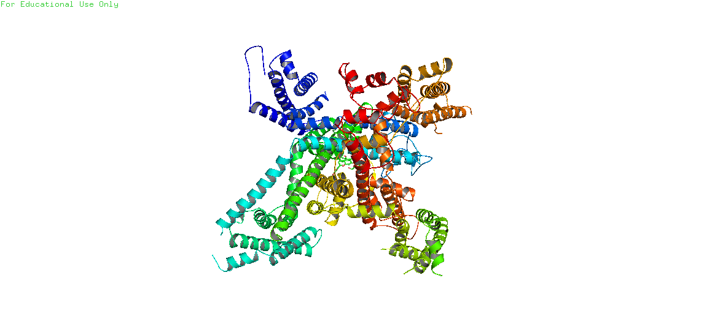

# Posts section

## Bioinformatics

<!-- <DevCard /> -->

  <!-- 1 -->
  

    

      <h6>Cav1.1 kanaliga ligand sifatida cynaroside moddasining biriktirilish natijalari</h6>
      <a href="./bio/2022-11-25-docking-on-ca-complex">Read More</a>
    

    
  

  <!-- 2 -->
  

    

      <h6>Ligand docking and binding site analysis with pymol and autodock/vina</h6>
      <a href="./bio/11-29-2022-ligand-docking-and-binding-site-analysis">Read More</a>
    

    
  

## Programming

  

    <h6>How to build modern docs with vitepress | Full text tutorial</h6>
    <a href="./dev/how-to-build-modern-docs-with-vitepress">Read More</a>
  

  

  

    <h6>Creating a Markdown Blog with NextJS | Full text tutorial</h6>
    <a href="./dev/creating-markdown-blog-with-nextjs">Read More</a>
  

  

